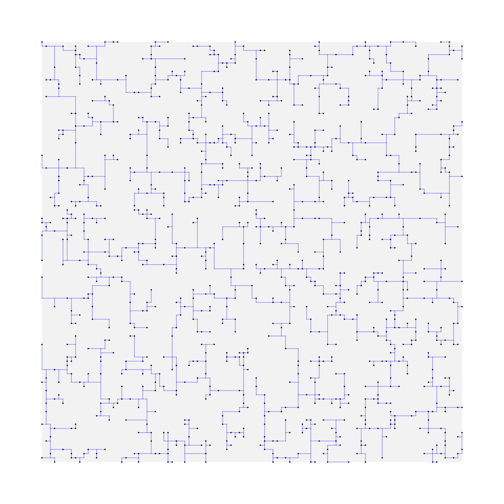
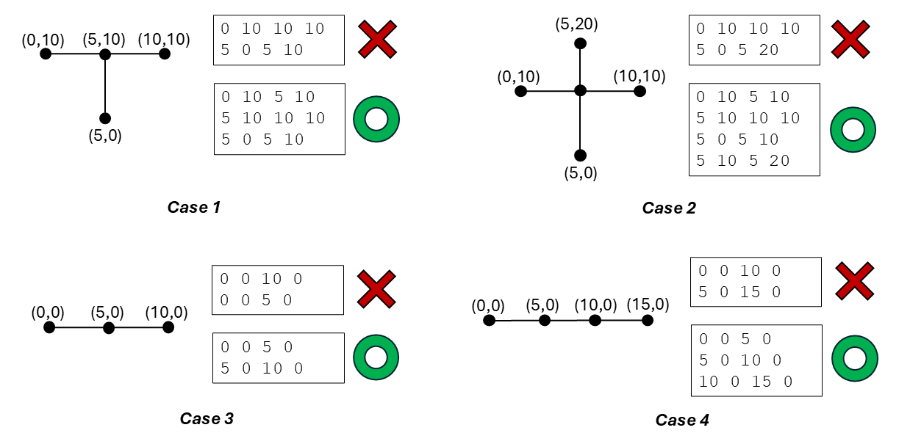

# ECE 382M VLSI CAD & Optimization - Homework 3
## Problem: Rectilinear Steiner Tree
Given a set of 2D nodes and a rectanguler boundary, generate a rectilinear Steiner tree constrained within the boundary. The objective is to minimize the total length of the tree.


### Input
The input format is defined as follows.
* The first line specifies the boundary with four integers: `xl` (lower x), `yl` (lower y), `xh` (upper x), and `yh` (upper y).
* The second line specifies the number of nodes `n`, followed by the coordinates (`x y`) of each node on separate lines.
#### Input Format
```
[boundary_xl] [boundary_yl] [boundary_xh] [boundary_yh]
[node_count]
[x1] [y1]
[x2] [y2]
...
[xn] [yn]
```
#### Input Example
```
0 0 10 10
3
5 0
0 5
10 10
```
#### Input Size
* 0 $\leq$ boundary_xl $\leq$ boundary_xh $\leq$ 10,000
* 0 $\leq$ boundary_yl $\leq$ boundary_yh $\leq$ 10,000
* 0 $\leq$ node_count $\leq$ 10,000

### Output
The output format is defined as follows.
* The first line specifies the number of edges `m` in the Steiner tree, followed by the edges on separate lines.
* Each edge is represented by four integers: `x_1 y_1 x_2 y_2`, indicating an edge from `(x_1, y_1)` to `(x_2, y_2)`.
#### Output Format
```
[edge_count]
[e1_x1] [e1_y1] [e1_x2] [e1_y2]
[e2_x1] [e2_y1] [e2_x2] [e2_y2]
...
[em_x1] [em_y1] [em_x2] [em_y2]
```
#### Output Example
```
4
5 0 5 5
0 5 5 5
5 5 5 10
5 10 10 10
```

### Connectivity Definition
* A node is considered connected to an edge if and only if it is an endpoint of that edge.
* To ensure a valid Steiner tree, any two edges may intersect only at a single shared endpoint.


## Compilation
* Ensure that the `-O3` optimization flag is used in the `Makefile`.
* All source code must be placed under the `src/` directory.
* Sample code is provided; you may use it as-is, modify it, or ignore it based on your preference.
* Ensure that the compilation generates a binary named `steiner` under the `bin/` directory.

## Evaluation
* The runtime limit for each test case is 30 seconds.
* Each case will be run only once. If your algorithm is nondeterministic, please note that only the result from the TA's execution of your program will be considered, and re-run requests will not be permitted for this matter.
* There are 10 test cases for evaluation, consisting of 5 public and 5 hidden cases, each worth 10%.
* Scoring is based on correctness and quality.
### Scoring Breakdown
1. Correctness (60%):
If your binary generates a valid rectilinear Steiner tree, you receive 6% per test case.
2. Quality (40%):
The remaining 4% of each test case's score is awarded based on how your Steiner tree's total length compares to the minimum total length achieved among all submissions.
If the Steiner tree is invalid, no quality score is awarded.
```math
Quality\_Score = 4\% \cdot \frac{Min\_Length}{Your\_Length}
```

## Platform
* Language: C/C++
* Environment: [ECE LRC Linux Machines](https://cloud.wikis.utexas.edu/wiki/spaces/eceit/pages/37752870/ECE+Linux+Application+Servers)

## Submission
You must submit all of your source code in `src/`, `Makefile`, and a 1–2 page report (PDF).
The report should briefly explain how you generate a rectilinear Steiner tree and must cite or reference any open-source resources used in this assignment.
Please follow the provided submission instructions.

1. Create a directory named `[LastName]_[UTEID]` (e.g., `Hsu_ch59569`).
2. Copy your `src/` folder into the `[LastName]_[UTEID]` directory.
3. Copy your `Makefile` into the `[LastName]_[UTEID]` directory.
4. Copy your `report.pdf` into the `[LastName]_[UTEID]` directory.
   ```bash
    └── [LastName]_[UTEID]/
        ├── src/
        │   ├── *.cc
        │   ├── *.h
        │   └── ...
        ├── Makefile
        └── report.pdf
    ```
5. Compress the directory using
```
zip -r [LastName]_[UTEID].zip [LastName]_[UTEID]
```
6. Submit the zip file to Canvas.

### How TA Will Run Your Code
1. `unzip [LastName]_[UTEID].zip`
2. `cd [LastName]_[UTEID]`
3. `make`
4. Execute the binary `./bin/steiner` to run the test cases under the directory `[LastName]_[UTEID]`.

## Checker
A checker binary is provided under the `checker/` directory to check your output.

Usage:
```
./checker/checker <input_file> <output_file>
```
Example:
```
./checker/checker input/sample_1.txt output/sample_1_out.txt
```

## Academic Honesty Policy
All work submitted for this assignment must be your own.
Plagiarism in any form is strictly prohibited.
You may discuss general concepts with peers, but viewing, sharing, or receiving specific code solutions is not allowed.
If you do not view others' code, it is highly unlikely that your code will be similar to theirs.
If you use open-source code, you must disclose it in your report and properly cite all external references and resources.
Violations of this policy will be subject to academic integrity regulations and may result in penalties, including a failing grade or disciplinary action.

## References
1. Chris Chu and Yiu-Chung Wong. "FLUTE: Fast lookup table based rectilinear Steiner minimal tree algorithm for VLSI design." IEEE Transactions on Computer-Aided Design of Integrated Circuits and Systems 27, no. 1 (2007): 70-83.
2. Hai Zhou. "Efficient Steiner tree construction based on spanning graphs." In Proceedings of the 2003 international symposium on Physical design, pp. 152-157. 2003.
3. Jeff Griffith, Gabriel Robins, Jeffrey S. Salowe, and Tongtong Zhang. "Closing the gap: Near-optimal Steiner trees in polynomial time." IEEE Transactions on Computer-Aided Design of Integrated Circuits and Systems 13, no. 11 (1994): 1351-1365.
